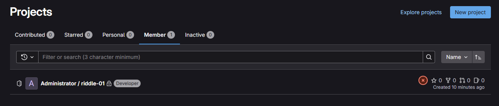

# Riddle Challenge

## Willkommen

Diese Challenge beinhaltet typische Security-Fehler, die in der Softwareentwicklung auftreten.
Eure Aufgabe ist es, diese Fehler zu finden und zu beheben.

Es warten insgesamt 4 Riddles auf euch.
Während die erste Aufgabe noch für jeden zu lösen ist, braucht man für die Folgenden schon etwas mehr Erfahrung.

## Spielregeln

Jedes Riddle ist ein eigenes Projekt.
Es wird mit Riddle 1 gestartet und fortlaufend mit Riddle 2, Riddle 3 und Riddle 4 fortgeführt.
Das Ziel ist es, den Fehler in jedem Riddle zu beheben.
Es gibt immer nur einen Fehler pro Riddle.

Dazu muss man den Fehler erst einmal in der Datei finden.
Dieser Fehler muss dann bestmöglich ausgebessert werden, damit er den Security Standards entspricht.
Das kann man direkt im GitLab Editor machen.
Dieser Fix muss nun commited werden.

Der nächste Commit darf erst dann gemacht werden wenn die Pipeline des Tests fertig ist!!!
Ein Test kann ca. 1 Minute dauern.

Sobald der Fix commited wurde, läuft im Hintergrund ein Test welcher bestätigt, ob der Fehler behoben wurde.
Wenn der Test keinen Fehler mehr findet schaltet er automatisch das nächste Riddle frei.

In der Projects Übersicht sieht man neben dem aktuellen Projekt ob der Test noch läuft.
Wenn der Test fehlschlägt wurde der Fehler nicht korrekt behoben.


## Setup

1. Docker installiert und aktiv
2. Docker Compose installiert
3. ``` cd setup ```
4. ``` docker compose up --build```
5. Warten bis alle Container gestartet sind (kann lange dauern, ca. 5-15 Minuten). Fertig ist es wenn gitlab-runner 1 und 2 laufen
6. http://localhost:80
7. Login: riddle / sadfsadf32!
8. Falls aufgefordert Passwort ändern
9. Links auf Projects gehen
10. Oben auf Member gehen

11. In riddle-01 Project gehen
12. Riddle-01 Readme lesen
